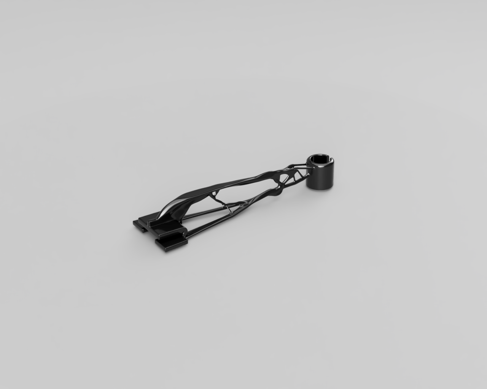
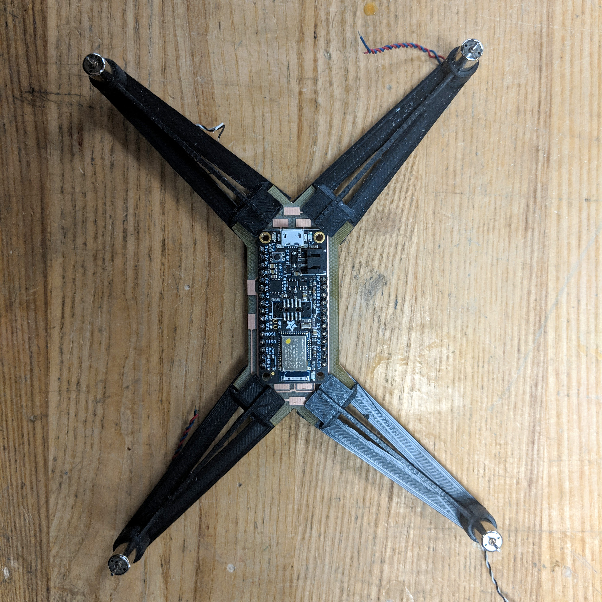
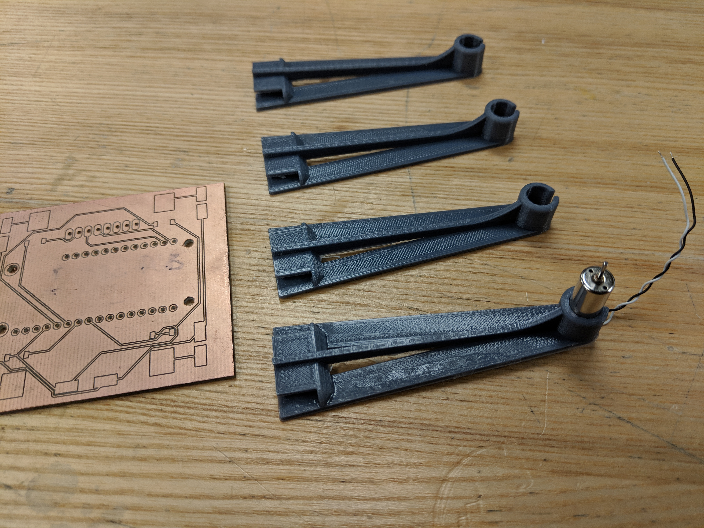
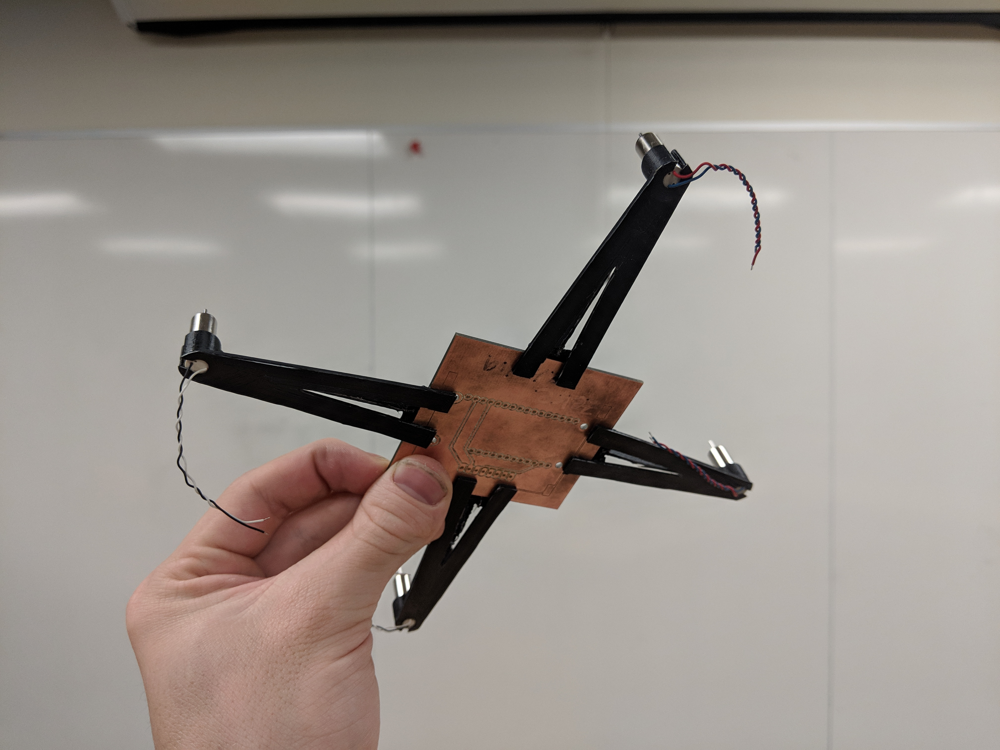
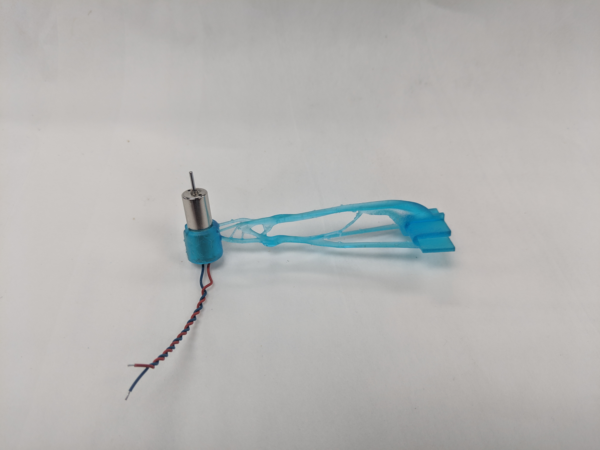
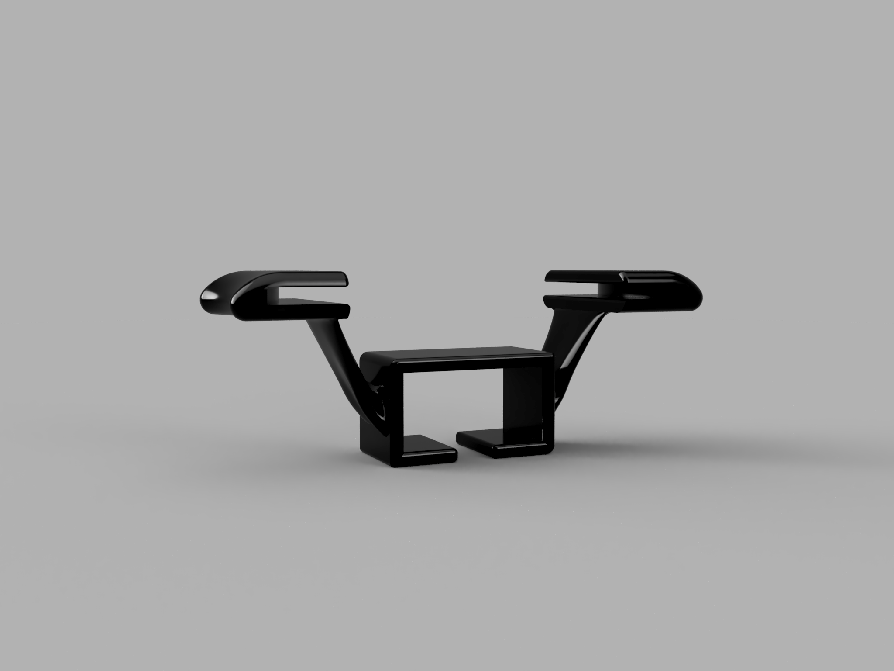
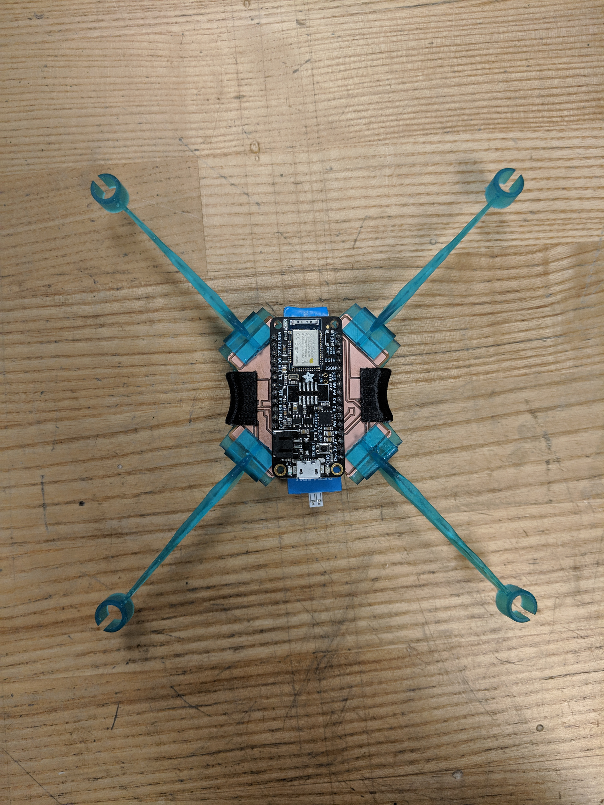
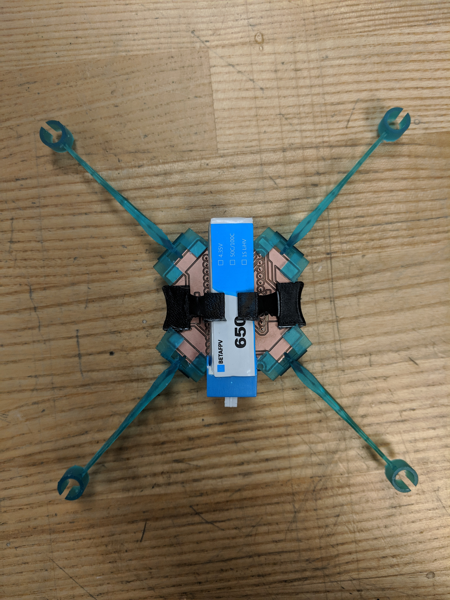
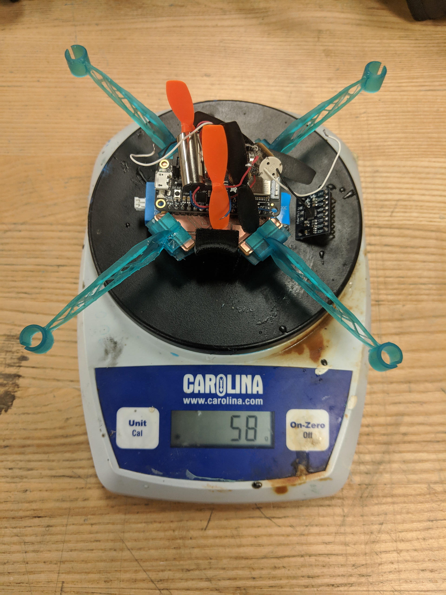

<!DOCTYPE html>
<head>
<meta charset='UTF-8'>
<title>Zeke</title>
<link rel="stylesheet" href="styles/type.css"></link>
<link rel="stylesheet" href="styles/position.css"></link>
<link href="styles/prism.css" rel="stylesheet" />
<!-- Favicon is GitHub profile image. -->
<link rel="icon" href="https://avatars1.githubusercontent.com/u/30676292?s=180&v=4">
</head>
<body>

    <nav>
      
      <ul>
          <li><a href="https://www.linkedin.com/in/zeke-medley-b1261a173/">Linkedin</a></li>
          <li><a href="https://github.com/ZekeMedley">GitHub</a></li>
          <li><a href="interesting-things.md">Interesting</a></li>
      </ul>
    </nav>
<section id="main">
<h1>Building a Better Drone Chassis</h1>
<h3>Feb 2019</h3>

Previous drone chassis designs suffered from two primary
limitations. Because they were made entirely of PLA they were
excessively flexible, and they weren't designed to break. Damaging one
part of the frame would require that the entire drone be reassembled
on a new frame. For an unstable system that requires substantial
tuning to reach acceptable PID constants, it is essential that it can
be easily repaired while also remaining light enough for flight.

To address these issues, this redesign adds snap on arms to the drone,
allowing for easy replacement in the event of breakage, and
experiments with generative design techniques to produce lightweight
components that retain their original stiffness.

The first issue I wanted to address with this chassis redesign was the
number of loose wires on the old drone chassis. Knowing that I would
need a sturdy center for the arms to clip onto, I designed a PCB in
Eagle that would act as a structural component, and serve to organize
loose wiring that impacted the stability of the drone.

The clip on arms were inspired by t-beams and feature a taller slot
for the motor with a snap in fit. The t-beam design makes for an arm
that strikes a balance between strength and weight. Additionally, I
cut out the bottom section of the arm, reducing weight while making
little compromise to its strength.

This version was effective, but I wanted to try to push the arm to be
even lighter while maintaining strength. To do this I setup a
generative design experiment in Fusion 360 with requirements that it
have similar strength to the novel t-beam approach. Giving the design
reasonable constraints proved to be fairly difficult, and my first
couple version's, while strong in the directions that I had specified,
proved to be useless because I hadn't thought to add constraints for
rotational force. In the end though the generated arm was 80% the
weight of the original one, and preserved its strength well.

With the arm design done, I made a small redesign of the circuit board
to reduce its size and the set about designing a battery holder. The
battery holder needed to snap onto the board as well, and like the
rest of the drone needed to be lightweight. I designed the battery
holder to have a multi-function clip. The bottom clip serves both to
allow the battery to slot into the holder nicely, and to allow the
whole holder to flex to clip onto the board.

With these new components, I ended up with a chassis that is lighter,
more rigid, and easily repairable compared to the older chassis.

</section>

</body>
</html>
