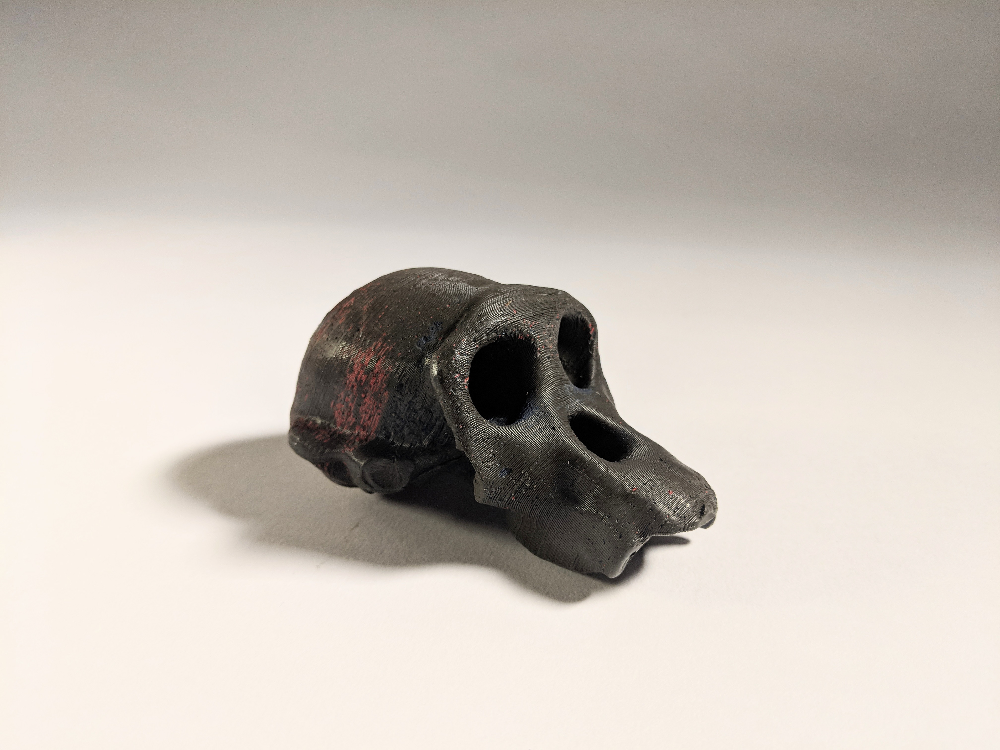
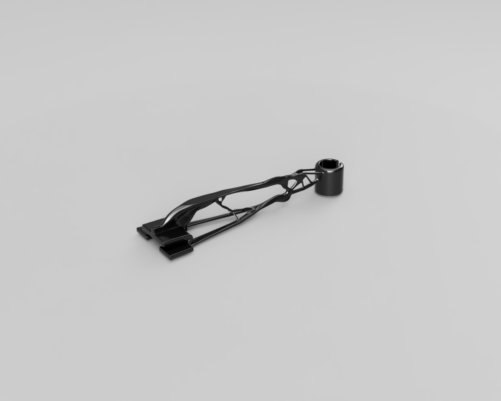

<!DOCTYPE html>
<head>
<meta charset='UTF-8'>
<title>Zeke</title>
<link rel="stylesheet" href="styles/type.css"></link>
<link rel="stylesheet" href="styles/position.css"></link>
<link href="styles/prism.css" rel="stylesheet" />
<!-- Favicon is GitHub profile image. -->
<link rel="icon" href="https://avatars1.githubusercontent.com/u/30676292?s=180&v=4">
</head>
<body>

    <nav>
      
      <ul>
          <li><a href="https://www.linkedin.com/in/zeke-medley-b1261a173/">Linkedin</a></li>
          <li><a href="https://github.com/ZekeMedley">GitHub</a></li>
          <li><a href="interesting-things.md">Interesting</a></li>
      </ul>
    </nav>
<section id="main">
<h1>Zeke Medley</h1>
<h3>— Creative Work.</h3>

Hi. Welcome to my website. I'm Zeke. I'm studying Electrical
Engineering and Computer Sciences at UC Berkeley with a particular
interest in programming languages and secure, fast code.

I've collected some of my work here.

<h3><a href="https://github.com/ZekeMedley/joy-divisions-cover-generation">Joy Division Cover Generation</a></h3>

→ Generates audio visualizations from sound files in the style of the
Unknown Pleasures album cover.

<h3><a href="https://github.com/zeek/paraglob">Paraglob</a></h3>

→ Data structure for fast string matching against large pattern
sets. Used in the Zeek Network Security Monitor.

<h3><a href="alternative-crayola.md">Alternative Crayola</a></h3>

→ A Crayola monkey skull and drawing machine.

<h3><a href="drone-chassis.md">Generative Design x Drone Chassis</a></h3>

→ Drone chassis created with Fusion 360's generative design tools.

<h3><a href="https://github.com/ZekeMedley/Where-Is-Your-Internet-IRL">Where Is Your Internet IRL</a></h3>

→ Records and plots the physical location of your internet traffic.

<h3><a href="panotech.md">Panotech</a></h3>

→ A critique of public surveillance and art installation.

<h3><a href="https://www.linkedin.com/in/zeke-medley-b1261a173/">Linkedin</a>, <a href="https://github.com/ZekeMedley/">GitHub</a></h3>

</section>

</body>
</html>
